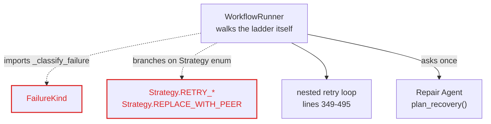
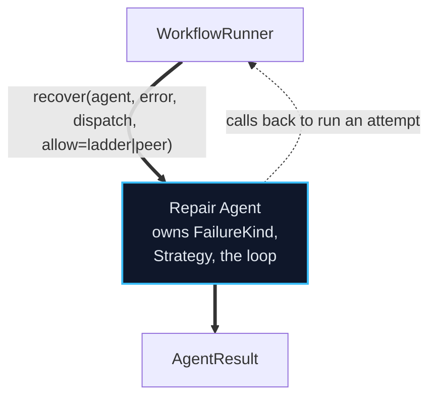
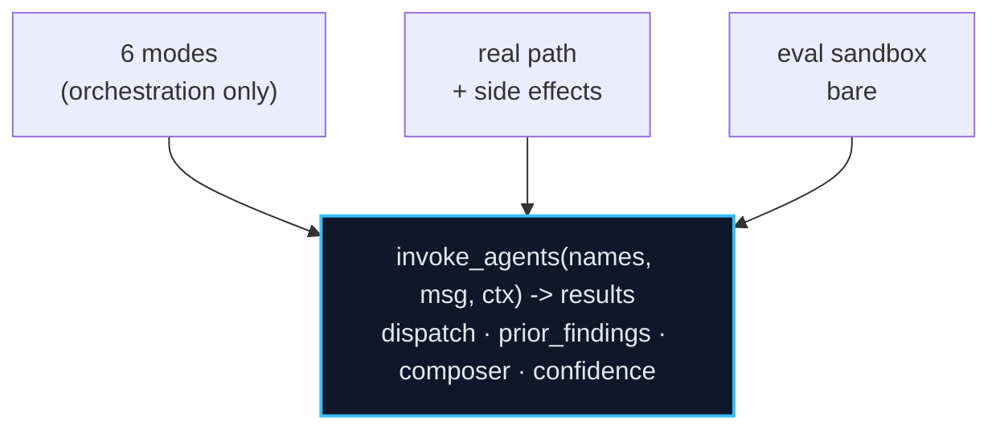
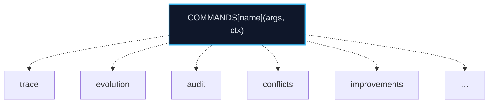
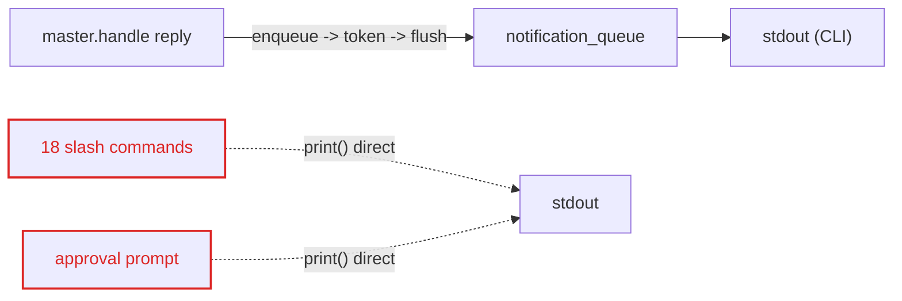
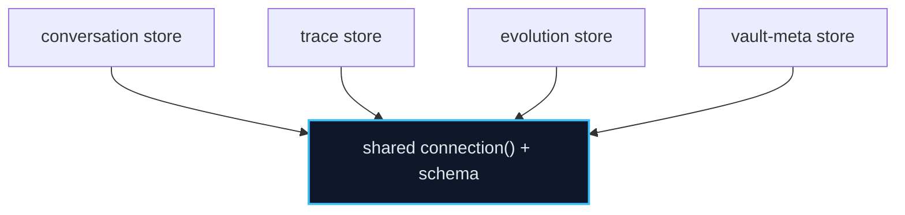

# Architecture Review — Ubongo (2026-06-05)

Deepening opportunities for v0.1 (complete; ~11,255 LOC; 723 tests green). The aim
is **depth**: more behaviour behind a smaller interface, so change, bugs, and tests
concentrate in one place. Vocabulary follows the `improve-codebase-architecture`
glossary — *module, interface, implementation, depth/deep/shallow, seam, adapter,
leverage, locality*. Nothing below is a bug; it is leverage left on the table.

Each candidate is checked against the existing ADRs so settled decisions are
reinforced, not re-litigated.

Legend: solid box = module · dashed line = seam · red = leakage · dark = deep module.

| # | Candidate | Strength | Category |
|---|-----------|----------|----------|
| 01 | Let Repair own the recovery ladder | **Strong** | in-process |
| 02 | One agent-invocation core under the modes and the eval sandbox | Worth exploring | in-process |
| 03 | Deepen the workflow-trace read into a view | **Strong** | in-process |
| 04 | A command registry behind the REPL | Worth exploring | local-substitutable |
| 05 | Make the notification queue a real seam — or scope it | Worth exploring | ports & adapters |
| 06 | Split the store god-module by concern | Speculative | in-process |

---

## 01 — Let Repair own the recovery ladder  ·  **Strong**

**Files:** `src/ubongo/runner.py:331–495`, `src/ubongo/agents/repair.py`

**Problem.** The runner imports Repair's private `_classify_failure` and branches on
the `Strategy` enum, walking the retry ladder across ~150 lines — Repair's logic,
living in the runner.

**Solution.** Repair exposes one `recover(agent, error, dispatch_fn, allow)`
interface and drives the ladder internally; the runner passes a dispatch callback
and which strategies are permitted.

**Before — taxonomy leaks into the runner**



**After — one recovery interface**



**Wins**
- locality: all recovery logic in `repair.py`
- interface shrinks; runner stops knowing the taxonomy
- leverage: one recovery path, six call sites
- Repair testable past one interface, no runner fixture

> **ADR-0003.** Keeps the accepted per-mode asymmetry — sequential walks the full
> ladder, fan-out only peer-replaces — by varying the `allow` argument. The decision
> stands; only the *location* of the loop moves behind the seam.

---

## 02 — One agent-invocation core under the modes *and* the eval sandbox  ·  Worth exploring

**Files:** `src/ubongo/runner.py:591–1324`, `src/ubongo/evolution/sandbox.py:342–416`

**Problem.** Dispatch, `prior_findings` threading, composer pick, and confidence are
re-implemented in each of six mode methods, and again in the eval sandbox — a seventh
copy that silently drifts from `runner.py`.

**Solution.** Extract a side-effect-free `invoke_agents()` core. Modes become thin
adapters that vary only their collaboration shape; the real path layers side effects
(governance, events, vault, queue) on top; the sandbox calls it bare.

**Before — two copies of "run agents"**

```
runner._run_sequential      — agent loop + collect
runner._run_parallel        — agent loop + collect
…competitive / collaborative / debate / speculative
sandbox._run_workflow_isolated — a 7th copy of the agent loop   ← drifts
```

**After — one deep core, thin adapters**



**Wins**
- implementation absorbs ~300 duplicated lines
- locality: composer/confidence rules fixed once
- sandbox cannot drift from the real loop
- modes testable as adapters over a fake core

> **ADR-0003 & ADR-0007.** Reinforces both. All six modes stay; the side-effect-free
> config evaluation stays — this makes the "isolated executor" ADR-0007 already
> mandates into a *shared seam* instead of a parallel copy. Biggest payoff, biggest
> blast radius: do it after Candidate 01.

---

## 03 — Deepen the workflow-trace read into a view  ·  **Strong**

**Files:** `store.last_n_workflow_runs` — `memory/store.py:871–1006`; caller — `repl.py:682–771`

**Problem.** The trace read returns a raw nested dict; `/trace` reconstructs the
schema by hand — the grouping the store could do leaks into the caller (~90 lines of
`r["workflow"]["agents"]`, `r["agent_runs"]`, `r["repair_runs"]` navigation).

**Solution.** Return a `WorkflowTrace` view (typed, grouped, render-ready). The store
absorbs the join + grouping; callers read fields.

**Before — shallow: interface nearly as complex as the implementation.**
The return type is a nested dict; every caller must learn the schema to decode it.

**After — deep: small interface, fat implementation.**
`WorkflowTrace[]` with typed fields; `/trace` just renders `t.agents`,
`t.governance.action`. The 4 queries + grouping stay hidden in the store.

```mermaid
flowchart LR
  subgraph Before["Before (shallow)"]
    S1["store.last_n_workflow_runs()"] -->|nested dict| C1["repl.py decodes ~90 lines"]
  end
  subgraph After["After (deep)"]
    S2["store.last_n_workflow_runs()"] ==>|WorkflowTrace[]| C2["repl.py renders fields"]
  end
  classDef leak stroke:#dc2626,stroke-width:2px,color:#dc2626;
  class C1 leak
```

**Wins**
- interface shrinks; schema stops leaking
- locality: one place knows the row shape
- leverage: any future trace reader is free
- small, safe, no ADR touched

---

## 04 — A command registry behind the REPL  ·  Worth exploring

**Files:** `_repl_loop` — `repl.py:956–1095`

**Problem.** 18 slash commands live as inline bodies in one dispatch method; the seam
to add a command is "edit `_repl_loop` in place."

**Solution.** A `name → handler` registry. Each command becomes an adapter with its
own parse/render; the loop just dispatches.

**Before — one method, 18 inline branches**

```
_repl_loop()
  if   head == "/trace":        …40 lines
  elif head == "/evolution":    …
  elif head == "/improvements": …
  elif head == "/conflicts":    …
  elif head == "/audit":        …
  … 13 more, bodies inline …          ← no seam; every new command edits this method
```

**After — dispatch over a registry seam**



**Wins**
- real seam: commands vary, the loop doesn't
- locality: a command's logic in one adapter
- each handler testable without the loop
- v0.2 Telegram reuses the same registry

---

## 05 — Make the notification queue a real seam — or scope it  ·  Worth exploring

**Files:** `repl.py:972–1085` (18 direct prints), `delivery/queue.py`

**Problem.** Only the composed reply crosses the queue seam; command output and
approval prompts `print()` straight to stdout — so "one outbound path" is true for
replies only.

**Solution.** Either route all outbound text through the queue (one real seam, v0.2
transports inherit it), or narrow the rule to "model-authored replies" and record
that scope.



**Wins**
- one adapter today (CLI), one rule
- two adapters (CLI + Telegram) make the seam real
- locality: delivery policy in one place
- removes the rule-vs-practice gap

> **ADR-0002.** States "every outbound message passes through `notification_queue`,
> even synchronous CLI responses." Practice diverges for command/approval output.
> This is the one candidate that asks to either honour the ADR fully or amend its
> scope — worth reopening because v0.2 transports depend on the answer.

---

## 06 — Split the store god-module by concern  ·  Speculative

**Files:** `memory/store.py` — 1,701 LOC, ~13 tables, ~100 functions

**Problem.** One 1,700-line module owns four unrelated concerns under a flat
namespace; understanding any one means scrolling past the other three.

**Solution.** Four concern-scoped stores over a shared connection seam. Same SQL
hidden, but each concern's interface stands alone.

**Before — one module, four concerns**

```
conversation state  · messages · summaries · facts
execution tracing   · workflow/agent/governance/repair
evolution           · lineage · evaluations · promotions
vault meta          · links · state · embeddings
                          all share one connection() and one flat namespace
```

**After — four deep stores, one connection seam**



**Wins**
- locality: a concern's reads/writes in one file
- interface per concern, not 100 flat functions
- AI-navigable: open one store, see one domain
- (cost) large mechanical change, modest payoff

> **ADR-0002.** Single-writer and single-connection stay intact — the split is by
> read/write surface, not by adding writers. Speculative because a stable 1,700-line
> data layer is a lot of motion for locality alone; revisit if `store.py` keeps
> growing in v0.2.

---

## Top recommendation — tackle first: **01, Let Repair own the recovery ladder**

Highest depth-per-risk. Contained to two files, conflicts with no ADR (it keeps
ADR-0003's per-mode asymmetry), and it produces all three deepening wins at once: the
runner stops importing Repair's private taxonomy (**leverage**), recovery logic
concentrates in one module (**locality**), and Repair becomes testable past one
interface instead of through a runner fixture. It also de-risks Candidate 02 — once
recovery lives behind a clean seam, extracting the shared `invoke_agents()` core is
the natural next move.

---

*Generated by `improve-codebase-architecture`. Source exploration covered the memory
store, the runner and its six execution modes, the REPL/Master pipeline, and the
evolution package. These are advisory deepening opportunities, not defects — the v0.1
build is green and complete.*
