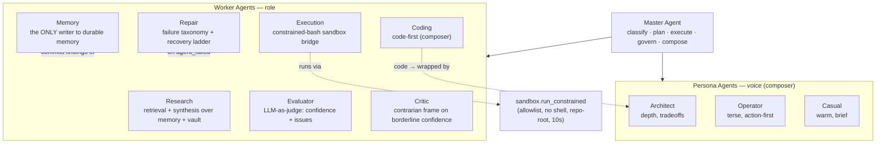
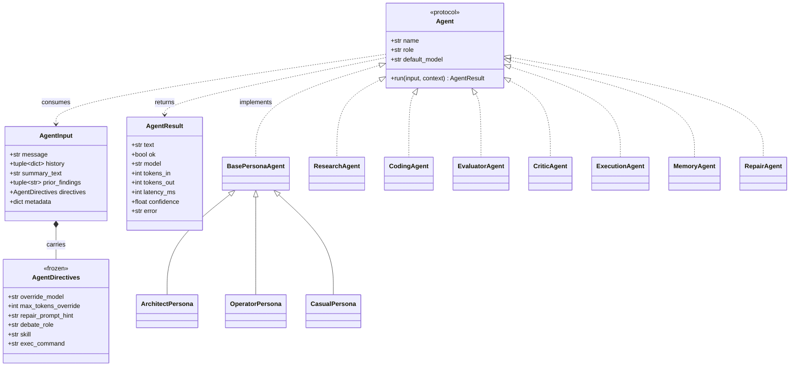
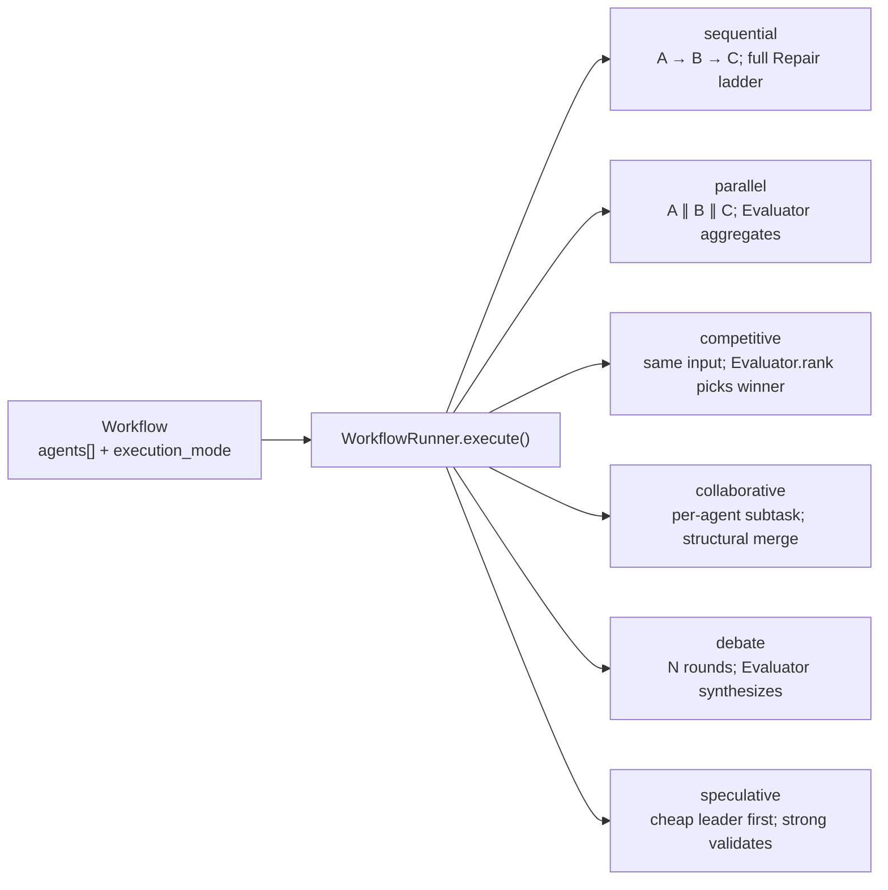

# Agent Diagrams — the worker fleet

Ubongo's worker agents are disposable: the Master Agent spawns them per turn,
they run once and return an `AgentResult`, then dissolve. Durable intelligence
lives in memory, workflows, and the evolution lineage — not in agents. This page
documents the fleet three ways: the **roster** (who does what), the **class
model** (the protocol they share), and the **dispatch model** (how the runner
drives them across the six execution modes).

## The fleet

`composer = True` marks the agents whose text becomes the user-facing response
(`WorkflowResult.text` is the **last** composer agent's text): the three Persona
Agents and the Coding Agent. Validators (Evaluator, Critic) and helpers
(Research, Execution, Memory, Repair) contribute `prior_findings` but never claim
the response.

| Agent | Role | composer | Model (default) |
| --- | --- | --- | --- |
| Architect / Operator / Casual | Persona voice; assembles the final answer | ✅ | `default` / `default` / `casual` |
| Research | Retrieval + synthesis over conversation memory + vault | — | `default` |
| Coding | Code generation / refactor / review | ✅ | `coding` |
| Evaluator | LLM-as-judge: confidence score + flagged issues | — | `evaluator` |
| Critic | Contrarian frame (borderline confidence, debate) | — | `critic` |
| Execution | Bridges a command to the shell sandbox | — | — (no LLM) |
| Memory | Single writer: messages, summaries, facts, vault, embeddings | — | — (no LLM) |
| Repair | Detects + recovers failed agents (taxonomy + ladder) | — | — (orchestrates) |

## Class model (UML)

The protocol is intentionally minimal — `run(input, context)` plus three string
attributes. The runner introspects nothing else (it reads `composer` via
`getattr`, defaulting to `False`).

`AgentDirectives` (typed, frozen) is the orchestrator→agent control surface — a
misspelled directive fails at construction, not silently (ADR-0012). Every LLM
agent runs its one model call through the shared envelope `agents/llm_run.py`
(`run_agent_llm` / `call_model_or_none`), so timing, model resolution, the
`LLMError → AgentResult(ok=False)` mapping, and result assembly live in one place.

## Dispatch model — the six execution modes

`WorkflowRunner.execute()` is async internally (a strategy coroutine per mode)
but sync at its public boundary. The mode is declared per workflow in
`workflows.yaml`; the Master selects agents and mode, the runner drives them.

- **Sequential** runs agents serially and walks the **full** Repair recovery
  ladder on failure (variant prompt → different model → smaller model → peer
  replacement → abort), capped at `agents.repair.max_attempts`.
- The five **fan-out** modes run concurrently via `asyncio.gather`; Repair acts
  only by **peer replacement** there (cancel-and-retry inside a gather is
  ambiguous). Debate carries the substituted peer through the rest of the turn;
  speculative scopes replacement to the cheap leader.
- **Competitive** and **debate** end with the Evaluator (`rank` / synthesize);
  the trailing evaluator is part of those mode contracts, so the Master does not
  also append one.

See [c4-components-orchestration.md](c4-components-orchestration.md) for the
Master + Runner internals, [flow-and-sequence.md](flow-and-sequence.md) for one
turn end to end, and [c4-components-authoring.md](c4-components-authoring.md) for
how authored skills (a separate, post-v0.1 subsystem) reach this fleet.
