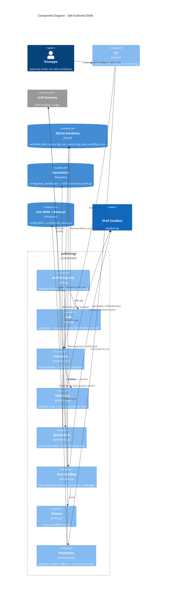

# C4 Level 3 — Component Diagram: Self-Authored Skills (authoring)

This drills into `src/ubongo/authoring/` (post-v0.1, [ADR-0013](../adr/0013-self-authored-skills-quarantine-and-approval.md)):
the package that lets Ubongo **author brand-new skills** — manually (`/author`)
and autonomously (a paused-by-default daemon) — behind a human approval boundary.
It mirrors the GP loop's shape but produces a different artifact: a new skill,
never a tuned prompt. Drafts are **quarantined** (invisible to the runtime) until
a human approves them.

## How it works

A **manual** draft (`/author`) and an **autonomous** cycle (`loop.run_one_cycle`)
share the same core:

1. **Infer (daemon only)** — `gaps.next_gap()` reads recent `workflow_runs`
   classifications and finds the most frequent intent that matched **no** skill
   (`suggested_skill = null`), excluding gaps already worked. The manual path
   skips this; the user supplies the description.
2. **Draft** — `candidate.draft_candidate()` asks the LLM for a `SkillCandidate`:
   SKILL.md frontmatter + body + optional prompt templates + an optional
   constrained-bash command template.
3. **Validate** — `validation.validate()` reuses the `skills._parse_skill` schema
   and enforces the **command-skill risk floor** (any command-bearing candidate
   is forced to `risk >= medium` / `irreversible`, in code); a command template
   is statically vetted by `sandbox.validate_command`.
4. **Quarantine** — `quarantine.persist()` writes the draft to
   `config/skills_candidates/<name>/` (not scanned by `skills.py`) and records an
   `authored_skills` row. The draft is invisible to the classifier and `/skills`.
5. **Evaluate** — `sandbox.evaluate_candidate()` scores the candidate
   side-effect-free (prompt judge over a few probes + a command dry-run) under a
   `CallBudget`; `fitness.score_candidate()` reduces it to a `[0,1]` scalar.
6. **Approve** — the user runs `/skill-candidates approve <id>`;
   `promotion.approve()` re-validates, **backs up** any existing same-named skill
   to `config/skills_backups/`, materializes the candidate into `config/skills/`,
   and reloads the registry. `rollback` restores the prior version or unregisters.

## Why it is safe

- **Quarantine before discoverability.** Drafts live outside the scanned skills
  directory; only `approve` makes one live. The daemon never approves.
- **Risk floor + static validation in code.** A self-authored command skill
  cannot understate its risk, and a command that would be refused at run time is
  refused at draft and approve — the same `sandbox.py` contract (ADR-0005). The
  allowlist stays a human-only change.
- **Paused, throttled daemon.** `AuthoringLoop` boots paused and `_should_cycle`
  throttles it (rolling-hour budget + optional cron); it only ever drafts.
- **Reversible + traced.** `approve` backs up the prior version; every draft,
  cycle, and decision is persisted (`authored_skills`, `authoring_runs`,
  `authoring_state`) and audited under `[authoring]`.
