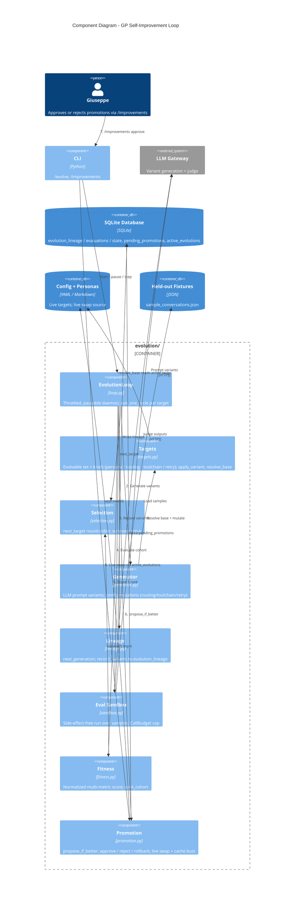

# C4 Level 3 — Component Diagram: GP Self-Improvement Loop

This drills into `src/ubongo/evolution/`: the genetic-programming loop that
evolves prompts and config, evaluates variants in a sandbox over held-out
fixtures, and proposes — but never auto-applies — promotions. The loop runs as a
background thread the REPL starts; it is **paused by default** and every
promotion is **human-approved**.

## How it works

One **cycle** (`loop.run_one_cycle`) advances a single target:

1. **Select** — `selection.next_target()` round-robins across the evolvable set
   from `targets.evolvable_targets()`. Targets carry a *kind*: `persona:*`
   prompts, `routing:default`, `toolchain:<workflow>`, and `retry:repair`.
2. **Generate** — `generator.generate()` produces a cohort. Prompt targets get
   LLM-authored variants; config targets get structured mutations
   (`_routing_mutations`, `_toolchain_mutations`, `_retry_mutations`) validated
   against their schema before they are allowed to compete.
3. **Record** — `lineage.record_variants()` stamps the cohort with the next
   generation number and persists it to `evolution_lineage`.
4. **Evaluate** — the **Eval Sandbox** runs each variant over a curated,
   anonymized held-out set (`tests/manual/fixtures/sample_conversations.json`)
   in a side-effect-free executor under a `CallBudget`, so evaluation never
   touches live memory and never runs away on cost.
5. **Score** — `fitness.compute_fitness()` normalizes the metrics across the
   cohort and `rank_cohort()` orders them; `selection.survivors()` keeps the
   top-k.
6. **Propose** — `promotion.propose_if_better()` compares the best survivor to
   the live baseline (`baseline_fitness`) and, only if it wins, writes a row to
   `pending_promotions`. Nothing changes in production yet.
7. **Approve** — the user runs `/improvements`; `promotion.approve()` writes
   `active_evolutions` and busts the relevant caches.
8. **Live swap** — `targets.resolve_base()` reads `active_evolutions`, so the
   next turn picks up the promoted prompt or config with no restart.
   `promotion.rollback()` reverses any promotion.

## Why it is safe

- **Paused by default.** `EvolutionLoop` does nothing until explicitly started,
  and `_should_cycle` throttles it (interval + optional cron) so it never
  competes with interactive turns.
- **Sandboxed evaluation.** Variants are scored in an isolated executor over
  fixtures, never against live memory, under a hard call budget.
- **Approved, not autonomous.** No variant reaches production without
  `/improvements` approval. This is the architectural rule from `CLAUDE.md`:
  *GP-driven self-improvement is approved, not autonomous.*
- **Fully traced.** Every variant, evaluation, proposal, and decision is
  persisted (`evolution_lineage`, `evolution_evaluations`, `evolution_state`,
  `pending_promotions`, `active_evolutions`) and audited.
