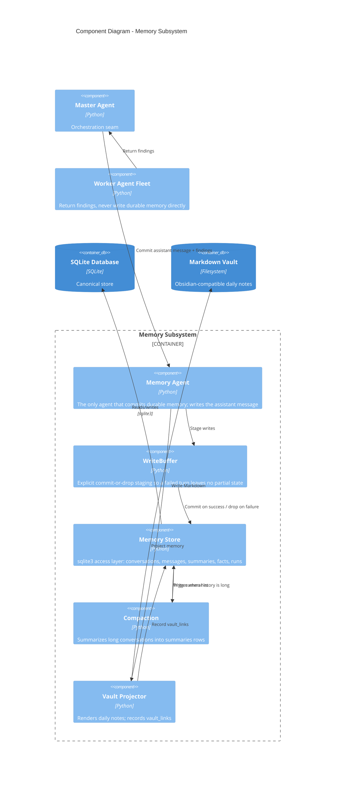

# C4 Level 3 — Component Diagram: Memory

This drills into the memory subsystem: the single writer to durable state, its
commit-or-drop buffer, and the Markdown projection.



## How it works

- **Single writer.** Worker agents return findings to the Master; only the
  **Memory Agent** commits durable state. This keeps write ordering and
  consistency in one place.
- **Commit-or-drop.** The **WriteBuffer** stages every write for a turn. If the
  turn succeeds the buffer commits atomically; if it fails the buffer is
  dropped, so a half-finished turn never leaves partial rows behind.
- **SQLite is canonical.** The **Memory Store** owns all `sqlite3` access. The
  schema spans conversation state (`conversations`, `messages`, `summaries`,
  `sessions`, `facts`), execution tracing (`workflow_runs`, `agent_runs`,
  `governance_decisions`, `repair_runs`), delivery (`notification_queue`), the
  vault graph (`vault_links`), and the not-yet-populated evolution tables.
- **Compaction** keeps context bounded: long conversations are summarized into
  `summaries` rows, which the Workflow Runner reads back as `summary_text`.
- **The vault is a projection.** The **Vault Projector** renders memory into
  Obsidian-compatible Markdown daily notes and records `vault_links` for the
  link graph. The projection is one-way in v0.1; bidirectional sync is Phase 21.

## Schema map

```
Conversation state   conversations, messages, summaries, sessions, facts
Execution tracing    workflow_runs, agent_runs, governance_decisions, repair_runs
Delivery             notification_queue
Vault graph          vault_links
Evolution (future)   evolution_lineage, evolution_evaluations,
                     pending_promotions, active_evolutions
```
