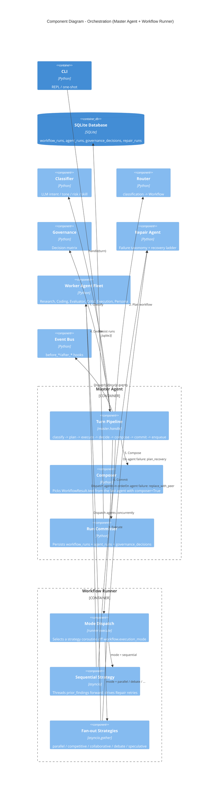

# C4 Level 3 — Component Diagram: Orchestration

This drills into the Master Agent and Workflow Runner: how a classified turn
becomes a dispatched fleet of worker agents and a governed, persisted result.

## How it works

The **Turn Pipeline** (`master.handle`) is the one orchestration seam. It runs a
fixed sequence and there is no bypass path:

1. **Classify** — the Classifier returns intent, tone, task type, suggested
   skill, risk, and a confidence score for the user message.
2. **Plan** — the Router maps that classification, via `routing.yaml` and
   `workflows.yaml`, to a `Workflow`: a persona, model, optional skill,
   execution mode, and an ordered tuple of agent names.
3. **Execute** — the Workflow Runner's **Mode Dispatch** picks a strategy
   coroutine off `workflow.execution_mode`. The runner is async internally and
   sync externally, so the Master stays synchronous.
4. **Decide** — Governance applies the decision matrix
   (`auto` / `ask_clarification` / `require_approval` / `reject`).
5. **Compose** — the result text comes from the last agent whose class declares
   `composer = True`. Validators (Evaluator, Critic) and helpers (Research,
   Execution) contribute `prior_findings` but never claim the response.
6. **Commit** — the Run Committer persists `workflow_runs`, `agent_runs`, and
   `governance_decisions`. Tracing is not optional.
7. **Enqueue** — the response goes to the Notification Queue (see the container
   diagram).

## Execution modes

Mode Dispatch selects one of six strategies:

| Mode | Status | Behavior |
|------|--------|----------|
| `sequential` | Active | Threads `prior_findings` forward agent to agent; drives the Repair recovery ladder. |
| `parallel` | Active | `asyncio.gather` fan-out; agents see no `prior_findings`. |
| `competitive` | Phase 12 | Multiple agents, best result wins. |
| `collaborative` | Phase 12 | Agents refine a shared draft. |
| `debate` | Phase 12 | Adversarial multi-round exchange. |
| `speculative` | Phase 12 | Fast draft plus verification. |

## Repair

The **Repair Agent** does not run as a workflow step. It is consulted
synchronously by the runner when an agent fails. It classifies the failure
(`FailureKind`) and walks an ordered strategy ladder: retry with a variant
prompt, retry with a different model, retry with a smaller model and shorter
prompt, or replace the failed agent with a peer. Sequential mode walks the full
ladder; fan-out modes act only on `replace_with_peer`. Every attempt is logged
to `repair_runs`.
