# C4 Level 3 — Component Diagram: Orchestration

This drills into the Master Agent and Workflow Runner: how a classified turn
becomes a dispatched fleet of worker agents and a governed, persisted result.

```mermaid
C4Component
  title Component Diagram - Orchestration (Master Agent + Workflow Runner)

  Container(cli, "CLI", "Python", "REPL / one-shot")
  ContainerDb(db, "SQLite Database", "SQLite", "workflow_runs, agent_runs, governance_decisions, repair_runs")

  Container_Boundary(master, "Master Agent") {
    Component(pipeline, "Turn Pipeline", "master.handle", "classify -> plan -> execute -> decide -> compose -> commit -> enqueue")
    Component(composer, "Composer", "Python", "Picks WorkflowResult.text from the last agent with composer=True")
    Component(commit, "Run Committer", "Python", "Persists workflow_runs + agent_runs + governance_decisions")
  }

  Container_Boundary(runner, "Workflow Runner") {
    Component(dispatch, "Mode Dispatch", "runner.execute", "Selects a strategy coroutine off workflow.execution_mode")
    Component(seq, "Sequential Strategy", "asyncio", "Threads prior_findings forward; drives Repair retries")
    Component(fanout, "Fan-out Strategies", "asyncio.gather", "parallel / competitive / collaborative / debate / speculative")
  }

  Component(classifier, "Classifier", "Python", "LLM intent / tone / risk / skill")
  Component(router, "Router", "Python", "plan_workflow: classification -> validated WorkflowPlan")
  Component(governance, "Governance", "Python", "Decision matrix")
  Component(repair, "Repair Agent", "Python", "Failure taxonomy + recovery ladder")
  Component(fleet, "Worker Agent Fleet", "Python", "Research, Coding, Evaluator, Critic, Execution, Persona")
  Component(envelope, "Model-call Envelope", "agents/llm_run", "run_agent_llm / call_model_or_none: timer, model resolve, error->AgentResult, logging")
  Component(bus, "Event Bus", "Python", "before_*/after_* hooks")

  Rel(cli, pipeline, "handle(turn)")
  Rel(pipeline, classifier, "1. Classify")
  Rel(pipeline, router, "2. plan_workflow -> WorkflowPlan (master adds model + skill)")
  Rel(pipeline, dispatch, "3. Execute")
  Rel(dispatch, seq, "mode = sequential")
  Rel(dispatch, fanout, "mode = parallel / debate / ...")
  Rel(seq, fleet, "Dispatch agents in order (typed AgentDirectives)")
  Rel(fanout, fleet, "Dispatch agents concurrently (typed AgentDirectives)")
  Rel(fleet, envelope, "Each LLM agent runs through the shared envelope")
  Rel(seq, repair, "On agent failure: plan_recovery")
  Rel(fanout, repair, "On agent failure: replace_with_peer")
  Rel(pipeline, governance, "4. Decide")
  Rel(pipeline, composer, "5. Compose")
  Rel(pipeline, commit, "6. Commit")
  Rel(commit, db, "Persist runs", "sqlite3")
  Rel(pipeline, bus, "Dispatch lifecycle events")

  UpdateLayoutConfig($c4ShapeInRow="3", $c4BoundaryInRow="1")
```

## How it works

The **Turn Pipeline** (`master.handle`) is the one orchestration seam. It runs a
fixed sequence and there is no bypass path:

1. **Classify** — the Classifier returns intent, tone, task type, suggested
   skill, risk, and a confidence score for the user message.
2. **Plan** — `router.plan_workflow` maps that classification, via `routing.yaml`
   and `workflows.yaml`, to a validated `WorkflowPlan` (workflow name, chosen
   persona, agent tuple with the evaluator appended, mode, rounds, timeout). It
   owns routing, persona hysteresis, the `/mode` override, name resolution, and
   structural mode/agents validation **at plan time**. `master.plan` maps the
   `WorkflowPlan` to a `Workflow` by adding the persona model and resolved skill —
   router = config, master = turn state + registries (ADR-0012).
3. **Execute** — the Workflow Runner's **Mode Dispatch** picks a strategy
   coroutine off `workflow.execution_mode`. The runner is async internally and
   sync externally, so the Master stays synchronous.
4. **Decide** — Governance applies the decision matrix
   (`auto` / `ask_clarification` / `require_approval` / `reject`).
5. **Compose** — the result text comes from the last agent whose class declares
   `composer = True`. Validators (Evaluator, Critic) and helpers (Research,
   Execution) contribute `prior_findings` but never claim the response.
6. **Commit** — the Run Committer persists `workflow_runs`, `agent_runs`, and
   `governance_decisions`. Tracing is not optional.
7. **Enqueue** — the response goes to the Notification Queue (see the container
   diagram).

## Execution modes

Mode Dispatch selects one of six strategies:

All six modes are active (Phase 12, merged). Only `sequential` and `parallel`
auto-route; the other four are opt-in per turn via `/mode <workflow>`.

| Mode | Routing | Behavior |
|------|---------|----------|
| `sequential` | Auto | Threads `prior_findings` forward agent to agent; drives the full Repair recovery ladder. |
| `parallel` | Auto | `asyncio.gather` fan-out; agents see no `prior_findings`. |
| `competitive` | `/mode` | Same input to several agents; the Evaluator's `rank()` picks the winner. |
| `collaborative` | `/mode` | Agents refine a shared draft. |
| `debate` | `/mode` | Agents argue N rounds (default 2); the Evaluator synthesizes. |
| `speculative` | `/mode` | Cheap draft plus a strong check; the Evaluator's `agree()` decides whether to correct. |

In every fan-out mode, Repair acts only by peer replacement (`_maybe_replace_failed`); the full strategy ladder runs in `sequential` alone.

## Model-call envelope and typed directives (ADR-0012)

Every LLM agent reaches the model through one shared envelope in
`agents/llm_run.py`: `run_agent_llm` (returns `AgentResult`, with an `on_success`
hook for the Evaluator's JSON parse) and `call_model_or_none` (for
`evaluator.rank` / `agree`). The envelope owns the mechanical parts common to
every call — the timer, `override_model` / `max_tokens_override` resolution, the
`LLMError → AgentResult(ok=False)` mapping, the `"<name>_run"` log line, and
result assembly — and calls the shared `llm.complete()` gateway underneath. What
stays in each agent's `run()` is the part that differs: prompt assembly, the
repair-hint append, and result interpretation.

The runner hands each agent a frozen `AgentDirectives` on `AgentInput.directives`
(`override_model`, `max_tokens_override`, `repair_prompt_hint`, `debate_role`,
`skill`, `exec_command`) — a typed control surface, not the old untyped
`metadata` dict. `AgentInput.metadata` remains a dict only for the Memory agent's
commit payload.

## Repair

The **Repair Agent** does not run as a workflow step. It is consulted
synchronously by the runner when an agent fails. It classifies the failure
(`FailureKind`) and walks an ordered strategy ladder: retry with a variant
prompt, retry with a different model, retry with a smaller model and shorter
prompt, or replace the failed agent with a peer. Sequential mode walks the full
ladder; fan-out modes act only on `replace_with_peer`. Every attempt is logged
to `repair_runs`.
