# C4 Level 2 — Container Diagram

Ubongo runs as a single Python process. The "containers" below are the
internal modules that own a distinct responsibility. They are not separately
deployable — v0.1 is deliberately not a distributed system — but each is the
single seam for its concern.

```mermaid
C4Container
  title Container Diagram - Ubongo

  Person(user, "Giuseppe", "The single user")
  System_Ext(llm, "LLM Providers", "Claude et al. via LiteLLM")
  System_Ext(os, "Local OS / Shell", "Host machine")

  Container_Boundary(proc, "Ubongo Process (Python, asyncio)") {
    Container(cli, "CLI", "Python", "REPL + one-shot entrypoints; slash commands; approval prompts")
    Container(master, "Master Agent", "Python", "Orchestration seam: classify, plan, execute, govern, compose, commit, enqueue")
    Container(classifier, "Classifier", "Python", "LLM-backed intent / tone / risk / skill classification per turn")
    Container(router, "Router", "Python", "Maps a classification to a Workflow via routing.yaml + workflows.yaml")
    Container(runner, "Workflow Runner", "Python, asyncio", "Dispatches agents across six execution modes; drives Repair retries")
    Container(agents, "Worker Agent Fleet", "Python", "Research, Coding, Evaluator, Critic, Execution, Persona, Memory, Repair")
    Container(governance, "Governance", "Python", "Decision matrix: auto / ask / require approval / reject")
    Container(sandbox, "Sandbox", "Python", "Constrained shell execution: allowlist, no metacharacters, timeout")
    Container(skills, "Skills Registry", "Python", "Loads skill definitions, prompts, risk/reversibility metadata")
    Container(bus, "Event Bus", "Python", "Synchronous pub/sub for before_*/after_* lifecycle hooks")
    Container(llmgw, "LLM Gateway", "Python, LiteLLM", "Single egress for model calls; retry + token accounting")
    Container(queue, "Notification Queue", "Python", "Every outbound message is enqueued here before delivery")
    Container(memstore, "Memory Store", "Python", "Only writer to durable memory; WriteBuffer commit-or-drop semantics")
    Container(vault, "Vault Projector", "Python", "Projects conversations + memory into Markdown daily notes")
    ContainerDb(db, "SQLite Database", "SQLite", "Canonical store: conversations, runs, governance, repair, queue, evolution")
    ContainerDb(vaultfs, "Markdown Vault", "Filesystem", "Obsidian-compatible projection of memory")
    ContainerDb(config, "Config", "YAML files", "routing, workflows, skills, personas, settings (secrets in .env only)")
  }

  Rel(user, cli, "Messages, slash commands", "stdin")
  Rel(cli, master, "handle(turn)")
  Rel(master, classifier, "Classify message")
  Rel(master, router, "Plan workflow")
  Rel(master, runner, "Execute workflow")
  Rel(runner, agents, "Dispatch agents")
  Rel(master, governance, "Gate the result")
  Rel(master, queue, "Enqueue response")
  Rel(queue, cli, "Deliver response")
  Rel(agents, llmgw, "Prompt models")
  Rel(classifier, llmgw, "Prompt model")
  Rel(llmgw, llm, "Completions", "HTTPS")
  Rel(agents, sandbox, "Run commands")
  Rel(sandbox, os, "subprocess", "shell=False")
  Rel(master, memstore, "Commit runs + messages")
  Rel(memstore, db, "Reads/writes", "sqlite3")
  Rel(memstore, vault, "Trigger projection")
  Rel(vault, vaultfs, "Writes Markdown")
  Rel(router, config, "Reads routing rules")

  UpdateLayoutConfig($c4ShapeInRow="3", $c4BoundaryInRow="1")
```

## Architectural rules this diagram encodes

- **Master Agent orchestrates, no bypass.** Every turn flows
  classify → plan → execute → govern → compose → commit → enqueue. There is no
  path from CLI to an agent that skips the Master.
- **Memory Store is the only writer** to SQLite, the vault, and (later)
  embeddings. Other agents return findings; the Memory Agent commits them. The
  WriteBuffer gives explicit commit-or-drop semantics so a failed turn leaves no
  partial state.
- **Every outbound message goes through the Notification Queue**, including
  synchronous CLI replies. Telegram (v0.2) and proactive jobs (v0.3) inherit
  this seam unchanged.
- **The Event Bus is the extension point.** v0.2+ behavior registers on named
  lifecycle events (`before_classify`, `after_execute`, `agent_failed`, ...)
  rather than editing the Master.
- **Config holds no secrets.** YAML files carry routing and behavior; secrets
  live only in `.env`.
- **Single process, hand-rolled.** No LangGraph, Temporal, Ray, Docker, or
  Redis. Concurrency inside the Workflow Runner is plain `asyncio`.

## Containers not yet built (Phases 16-21)

The SQLite schema already defines `evolution_lineage`,
`evolution_evaluations`, `pending_promotions`, and `active_evolutions`, but the
**GP self-improvement loop** that fills them is a future tier. When it lands it
will be an additional container reading held-out conversation fixtures and
writing variants for human-approved promotion. Embedding indexing
(`sqlite-vec`) and bidirectional vault sync are likewise future containers.
