# C4 Level 2 — Container Diagram

Ubongo runs as a single Python process. The "containers" below are the
internal modules that own a distinct responsibility. They are not separately
deployable — v0.1 is deliberately not a distributed system — but each is the
single seam for its concern.

```mermaid
C4Container
  title Container Diagram - Ubongo

  Person(user, "Giuseppe", "The single user")
  System_Ext(llm, "LLM Providers", "Claude et al. via LiteLLM")
  System_Ext(os, "Local OS / Shell", "Host machine")

  Container_Boundary(proc, "Ubongo Process (Python, asyncio)") {
    Container(cli, "CLI", "Python", "REPL + one-shot entrypoints; slash commands; approval prompts")
    Container(master, "Master Agent", "Python", "Orchestration seam: classify, plan, execute, govern, compose, commit, enqueue")
    Container(classifier, "Classifier", "Python", "LLM-backed intent / tone / risk / skill classification per turn")
    Container(router, "Router", "Python", "plan_workflow: classification -> validated WorkflowPlan via routing.yaml + workflows.yaml")
    Container(runner, "Workflow Runner", "Python, asyncio", "Dispatches agents across six execution modes; drives Repair retries; passes typed AgentDirectives")
    Container(agents, "Worker Agent Fleet", "Python", "Research, Coding, Evaluator, Critic, Execution, Persona, Memory, Repair; LLM agents share one model-call envelope (agents/llm_run)")
    Container(governance, "Governance", "Python", "Decision matrix: auto / ask / require approval / reject")
    Container(sandbox, "Sandbox", "Python", "Constrained shell execution: allowlist, no metacharacters, timeout")
    Container(skills, "Skills Registry", "Python", "Loads skill definitions, prompts, risk/reversibility metadata")
    Container(bus, "Event Bus", "Python", "Synchronous pub/sub for before_*/after_* lifecycle hooks")
    Container(llmgw, "LLM Gateway", "Python, LiteLLM", "Single egress for model calls; retry + token accounting")
    Container(queue, "Notification Queue", "Python", "Every outbound message is enqueued here before delivery")
    Container(memstore, "Memory Store", "Python", "Only writer to durable memory; WriteBuffer commit-or-drop; sqlite-vec recall")
    Container(vault, "Vault Projector", "Python", "Projects conversations + memory into Markdown daily notes")
    Container(evoloop, "GP Self-Improvement Loop", "Python thread", "Tier 5 daemon: generate -> evaluate -> rank -> propose; paused by default")
    Container(vaultwatch, "Vault Watcher", "Python thread", "Tier 6 daemon: polls vault, ingests external edits, queues conflicts")
    Container(authoring, "Skill Authoring", "Python (+ thread)", "Post-v0.1: drafts new skills -> quarantine -> human approval gate; AuthoringLoop daemon, paused by default")
    ContainerDb(db, "SQLite Database", "SQLite", "Canonical store: conversations, runs, governance, repair, queue, evolution, vec")
    ContainerDb(vaultfs, "Markdown Vault", "Filesystem", "Obsidian-compatible projection + audit log")
    ContainerDb(config, "Config", "YAML files", "routing, workflows, skills, personas, settings (secrets in .env only)")
  }

  Rel(user, cli, "Messages, slash commands", "stdin")
  Rel(cli, master, "handle(turn)")
  Rel(master, classifier, "Classify message")
  Rel(master, router, "plan_workflow -> WorkflowPlan")
  Rel(master, runner, "Execute workflow")
  Rel(runner, agents, "Dispatch agents")
  Rel(master, governance, "Gate the result")
  Rel(master, queue, "Enqueue response")
  Rel(queue, cli, "Deliver response")
  Rel(agents, llmgw, "Prompt models")
  Rel(classifier, llmgw, "Prompt model")
  Rel(llmgw, llm, "Completions", "HTTPS")
  Rel(agents, sandbox, "Run commands")
  Rel(sandbox, os, "subprocess", "shell=False")
  Rel(master, memstore, "Commit runs + messages")
  Rel(memstore, db, "Reads/writes", "sqlite3")
  Rel(memstore, vault, "Trigger projection")
  Rel(vault, vaultfs, "Writes Markdown")
  Rel(router, config, "Reads routing rules")
  Rel(evoloop, llmgw, "Generate + judge variants")
  Rel(evoloop, db, "Lineage, fitness, pending_promotions", "sqlite3")
  Rel(evoloop, config, "Reads targets; live swap via active_evolutions")
  Rel(cli, evoloop, "/improvements approve / reject; /evolve")
  Rel(vaultwatch, vaultfs, "Polls for external edits")
  Rel(vaultwatch, memstore, "Ingest edits, queue conflicts")
  Rel(cli, authoring, "/author, /skill-candidates, /authoring")
  Rel(authoring, llmgw, "Draft skill + judge")
  Rel(authoring, sandbox, "validate_command + dry-run")
  Rel(authoring, skills, "Materialize on approve; reload")
  Rel(authoring, db, "authored_skills, authoring_runs/state", "sqlite3")
  Rel(authoring, config, "Quarantine / live skills / backups dirs")

  UpdateLayoutConfig($c4ShapeInRow="3", $c4BoundaryInRow="1")
```

## Architectural rules this diagram encodes

- **Master Agent orchestrates, no bypass.** Every turn flows
  classify → plan → execute → govern → compose → commit → enqueue. There is no
  path from CLI to an agent that skips the Master.
- **Memory Store is the only writer** to SQLite, the vault, and (later)
  embeddings. Other agents return findings; the Memory Agent commits them. The
  WriteBuffer gives explicit commit-or-drop semantics so a failed turn leaves no
  partial state.
- **Every outbound message goes through the Notification Queue**, including
  synchronous CLI replies. Telegram (v0.2) and proactive jobs (v0.3) inherit
  this seam unchanged.
- **The Event Bus is the extension point.** v0.2+ behavior registers on named
  lifecycle events (`before_classify`, `after_execute`, `agent_failed`, ...)
  rather than editing the Master.
- **Config holds no secrets.** YAML files carry routing and behavior; secrets
  live only in `.env`.
- **Single process, hand-rolled.** No LangGraph, Temporal, Ray, Docker, or
  Redis. Concurrency inside the Workflow Runner is plain `asyncio`.

## Background daemons (Tiers 5–6 + post-v0.1, all built)

Three background daemon threads run alongside the synchronous turn loop, started
and stopped by the REPL:

- **GP self-improvement loop** (`evolution.loop.EvolutionLoop`, Tier 5): the full
  `src/ubongo/evolution/` package — generation, sandboxed evaluation + fitness
  over held-out fixtures, the autonomous throttled/pausable cycle, and
  human-approved promotions (writing `pending_promotions` / `active_evolutions`,
  applied via live swap). Evolvable targets span persona prompts and
  routing/tool-chain/retry config. Off (paused) by default.
- **Vault watcher** (`memory.vault_watch.VaultWatcher`, Tier 6): a no-dependency
  poller that ingests external vault edits (re-embed into `vec_vault`) and queues
  conflicts. Off by default.
- **Authoring daemon** (`authoring.loop.AuthoringLoop`, post-v0.1, [ADR-0013](../adr/0013-self-authored-skills-quarantine-and-approval.md)): the
  `src/ubongo/authoring/` package — drafts brand-new skills from inferred capability
  gaps into quarantine (`config/skills_candidates/`), scores them, and never
  registers them; the human approves via `/skill-candidates`. Paused by default.
  Detailed in [c4-components-authoring.md](c4-components-authoring.md).

Semantic recall (`sqlite-vec` indexing of messages and vault notes) is wired into
the turn path itself (`recall(query)`), best-effort and degrading to recency-only
when embeddings are unavailable. Nothing in v0.1 is left unbuilt.

## Channels beyond the CLI (v0.1.1 web, v0.1.4 MCP) — same seam, no new boxes

The diagram shows the CLI as the user-facing container; the two later channels
deliberately reuse its seam rather than adding orchestration boxes. The **web
UI** (`src/ubongo/web/`, Streamlit) and the **MCP server** (`src/ubongo/mcp/`,
the official SDK as an optional extra) both call the same `master.handle`
entry the CLI uses — one human-facing, one machine-facing (tools
`ubongo_send` / `ubongo_recall` + two read-only resources, stdio or
streamable HTTP; [ADR-0015](../adr/0015-mcp-server-additive-channel.md)).
Every channel turn flows through the identical pipeline and the Notification
Queue; neither channel starts the background daemons.

## Observability + service control (v0.1.3) — container boxes unchanged

The local profiler ([ADR-0014](../adr/0014-local-only-observability-profiler.md))
is an in-process library inside the CLI container, not a new container or daemon:
`/profile` reads the run tables the turn already persists, and the opt-in
cProfile/tracemalloc wraps live around the turn call. `ubongo-ctl.sh` and the
systemd unit (`deploy/ubongo-web.service`) are operational tooling that
background the existing Web UI container — no new listener, boundary, or box at
this level.
