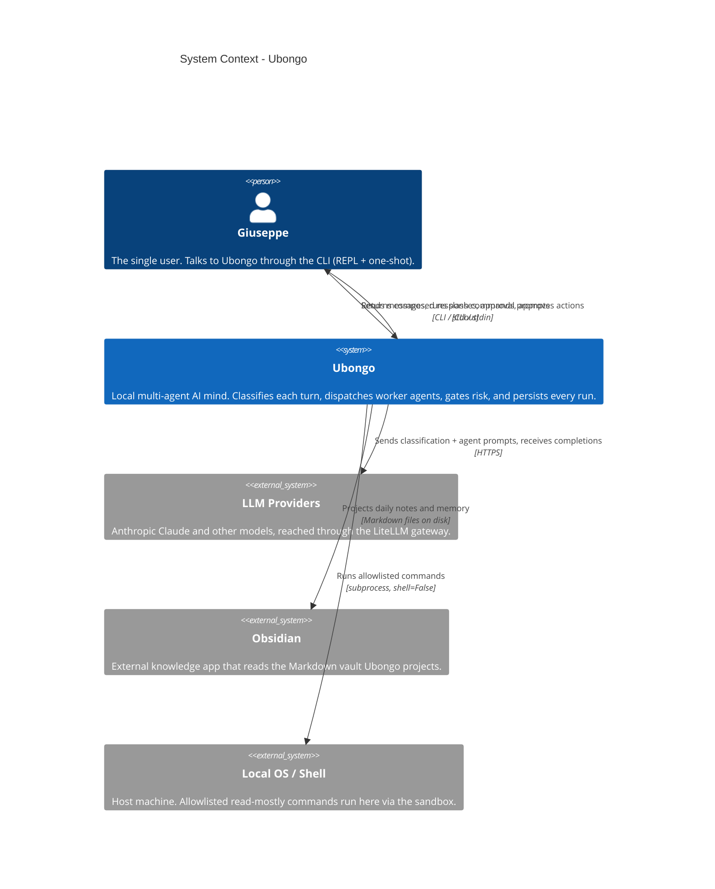

# C4 Level 1 — System Context

Ubongo is a personal, intent-routed AI mind for a single user, running locally as a
CLI. It orchestrates a fleet of worker agents across multiple LLM calls, gates
risky actions, and persists everything it does.

## Notes

- **One user, one machine.** v0.1 is CLI-only; Telegram is v0.2 and would be an
  additive transport, not a change to this context.
- **LLM access is centralized.** Every model call goes through one gateway
  (`llm.py`, LiteLLM), so provider choice is configuration, not code.
- **The vault is an output, not a dependency.** Ubongo writes Markdown; Obsidian
  is one possible reader. Ubongo runs fine with no Obsidian installed.
- **Shell access is constrained by design.** The only path to the host OS is the
  sandbox: explicit command allowlist, no shell metacharacters, no path
  traversal, repo-root cwd, 10s timeout.
