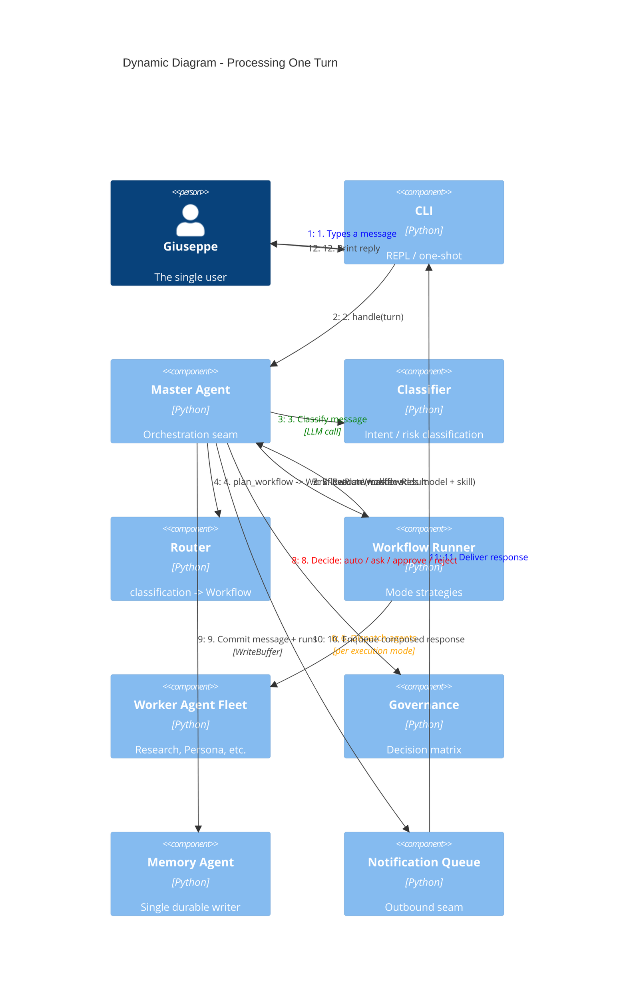

# C4 Dynamic — A Single Turn

This traces one user message end to end through the orchestration pipeline.

## Step-by-step

1-2. The user types a message; the CLI hands it to `master.handle`.

3. **Classify.** One LLM call returns intent, tone, task type, suggested skill,
   risk, and confidence.

4. **Plan.** `router.plan_workflow` maps the classification, through `routing.yaml`
   and `workflows.yaml`, to a validated `WorkflowPlan` (persona, agents with the
   evaluator appended, mode, rounds, timeout) — validating the mode/agents shape at
   plan time. `master.plan` adds the persona model and resolved skill to make the
   `Workflow` (ADR-0012).

5-6. **Execute.** The Workflow Runner selects the strategy coroutine for the
   workflow's execution mode and dispatches the agent fleet — in order for
   `sequential`, concurrently for fan-out modes. If an agent fails, the runner
   consults the Repair Agent before giving up.

7. The runner returns a `WorkflowResult`. Its `text` is taken from the last
   agent with `composer = True`.

8. **Decide.** Governance applies the decision matrix. A `require_approval`
   action pauses here and the CLI prompts the user for y/n before continuing;
   `reject` ends the turn with an apology.

9. **Commit.** The Master calls the Memory Agent, which stages the assistant
   message plus `workflow_runs` / `agent_runs` / `governance_decisions` rows in
   the WriteBuffer and commits them atomically.

10-12. **Enqueue and deliver.** The composed response is enqueued in the
   Notification Queue — every outbound message goes through it, even synchronous
   CLI replies — then the CLI dequeues and prints it.

## Lifecycle events

At each pipeline boundary the Master dispatches a `before_*` / `after_*` event
on the Event Bus (`before_classify`, `after_execute`, `agent_failed`,
`before_send`, ...). v0.2+ behavior registers handlers on these events rather
than editing the pipeline, so the steps above stay stable as the system grows.
