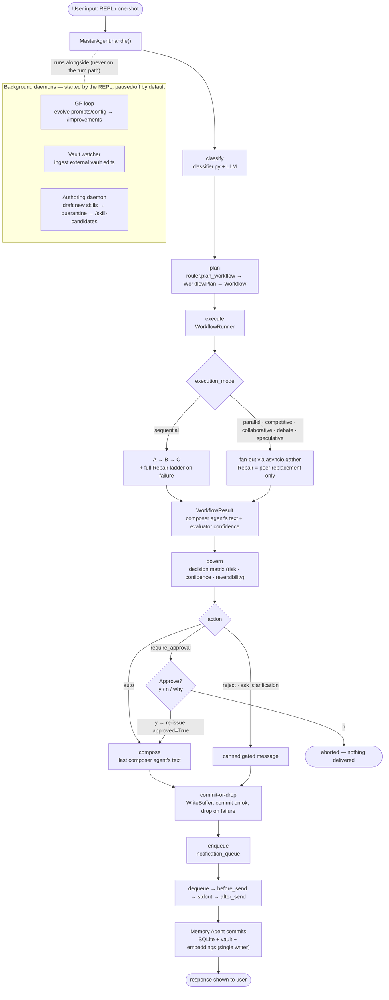
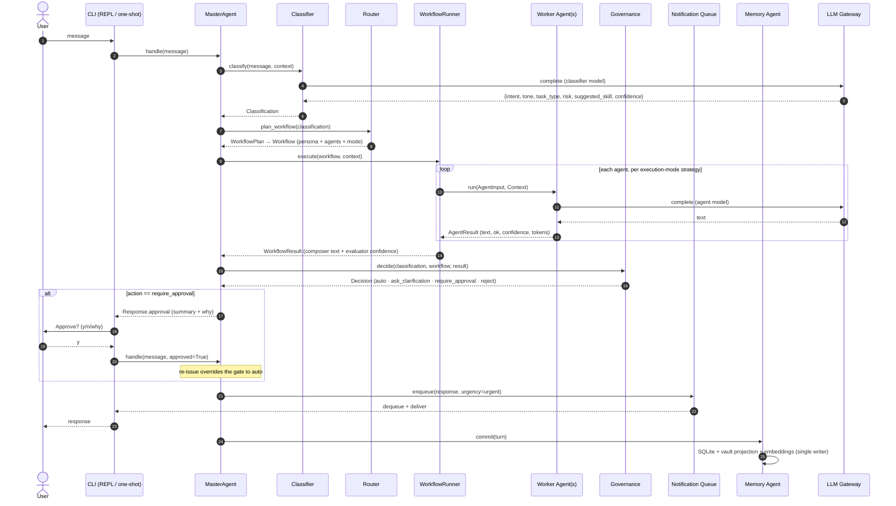

# Flow Diagram + UML Sequence — one turn, end to end

How a single user message moves through Ubongo: the **flow diagram** (control
flow with the governance branch and the background daemons) and the **UML
sequence diagram** (the same turn as message passing between components over
time). Both reflect the real pipeline in `master.handle`:
`classify → plan → execute → govern → compose → commit → enqueue`.

## Flow diagram

Notes:

- **No bypass.** Every turn flows through `MasterAgent.handle`; there is no path
  from the CLI to an agent that skips classify/plan/govern.
- **Governance branch.** `require_approval` does not deliver automatically — the
  REPL prompts `y/n/why`; `y` re-issues the turn with `approved=True` (which
  overrides the gate to `auto`); `n` aborts. One-shot mode prints the gated
  message and exits non-zero (no interactive approval).
- **Commit-or-drop.** The turn body runs inside a `WriteBuffer`; the assistant
  message commits only on success, so a failed turn leaves no partial state.
- **Every event fires.** `before_/after_` hooks bracket each stage
  (`before_classify`, `after_execute`, `before_compose`, …); v0.2+ behavior
  registers on these rather than editing the Master.

## UML sequence diagram

The sequence is the same pipeline as the flow diagram, drawn as message passing.
The repair ladder (on `agent_failed`) and the `before_/after_` events are elided
here for readability — see [c4-dynamic-turn.md](c4-dynamic-turn.md) for the
event-annotated trace and [c4-components-orchestration.md](c4-components-orchestration.md)
for the Master + Runner internals.
