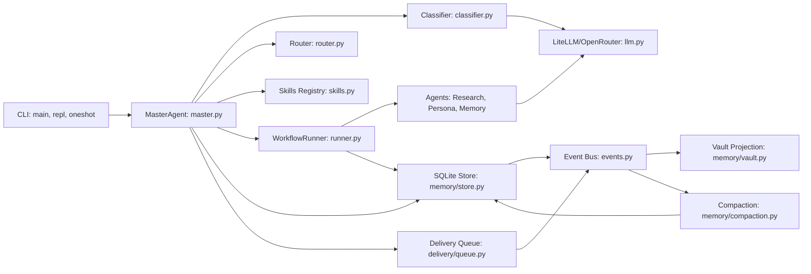
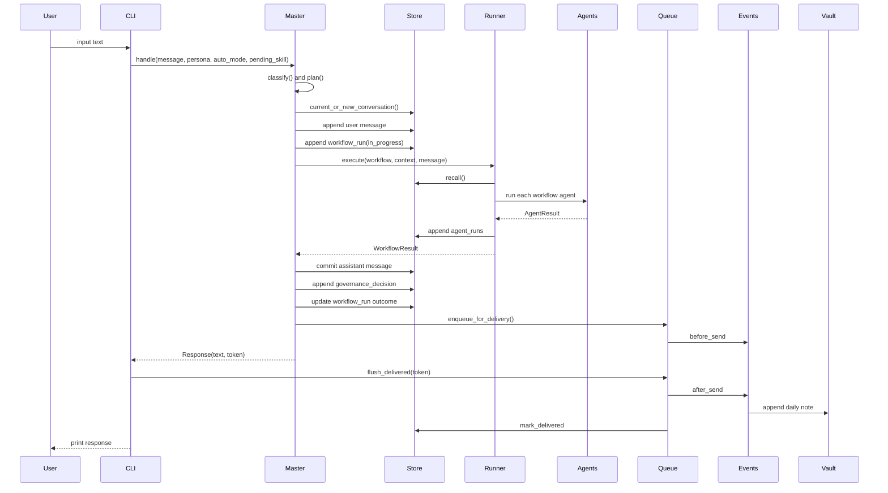
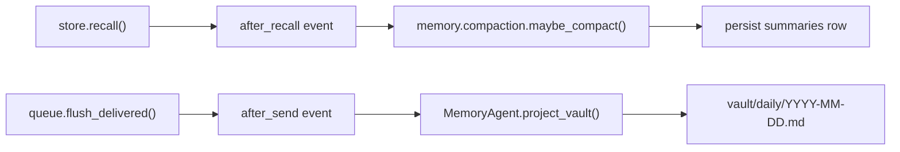
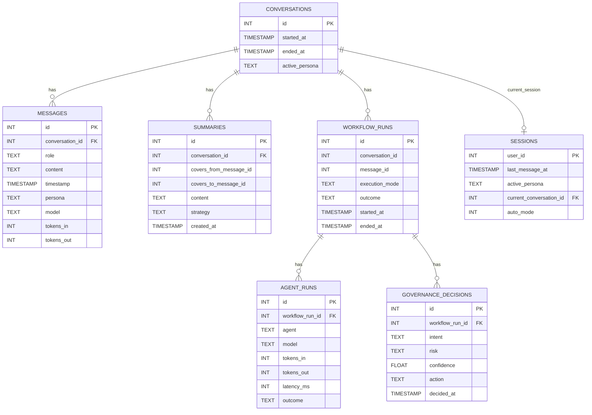
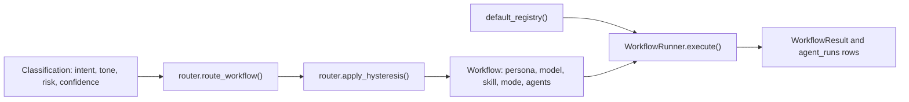
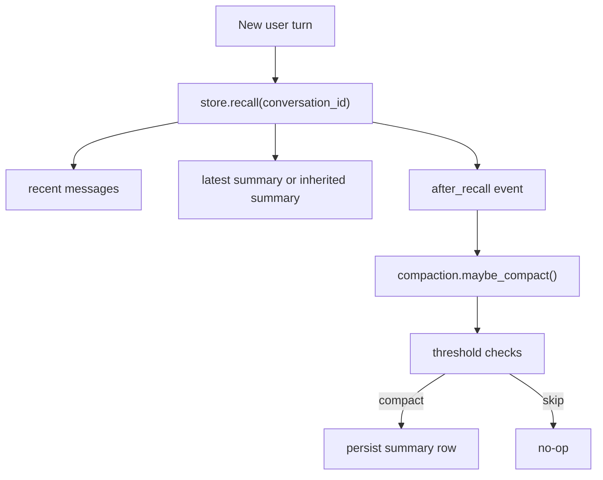
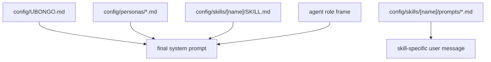

# Ubongo System Architecture (Current Implementation)

This document describes the current codebase state (through Phase 9 in `STATUS.md`), focusing on runtime flow, subsystem boundaries, and persistent data model.

Diagram source file (editable in draw.io):
- [system-architecture.drawio](./diagrams/system-architecture.drawio)

## 1) Runtime Components

Draw.io page: `Runtime Components`

Summary:
- CLI (`__main__.py`, `repl.py`, `oneshot.py`) enters through `MasterAgent`.
- `MasterAgent` handles classify/plan/execute/govern/compose and persistence seams.
- `WorkflowRunner` dispatches worker agents (`research`, `persona:*`, `memory`).
- Queue and event bus coordinate side effects (`before_send`, `after_send`).
- SQLite store is canonical memory; vault is projected markdown.

## 2) End-to-End Turn Flow

Draw.io page: `Turn Flow`

Flow:
1. User input (REPL or one-shot)
2. `MasterAgent.handle()` classify + plan
3. Persist user turn + insert `workflow_runs` (`in_progress`)
4. `WorkflowRunner.execute()` agent dispatch
5. Persist assistant turn + governance decision + workflow outcome update
6. Enqueue response + `before_send`
7. Print response to terminal
8. `flush_delivered()` -> `after_send` -> vault projection -> mark delivered

## 3) Events and Side Effects

Draw.io page: `Events and Side Effects`

Key event chains:
- `store.recall()` -> `after_recall` -> `memory.compaction.maybe_compact()`
- `queue.flush_delivered()` -> `after_send` -> `MemoryAgent.project_vault()` -> daily note append

## 4) SQLite Data Model

Draw.io page: `SQLite Data Model`

Core operational tables:
- `conversations`, `messages`, `summaries`, `sessions`
- `workflow_runs`, `agent_runs`, `governance_decisions`
- `notification_queue`

Future-phase tables already present in schema:
- `facts`, `evolution_lineage`, `evolution_evaluations`, `pending_promotions`, `active_evolutions`, `vault_links`

## 5) Workflow + Agent Model

Workflows are configured in `config/workflows.yaml` and routed by `config/routing.yaml`.

Current execution mode implemented: `sequential`.

Runtime pattern:
- `classifier.classify()` -> `router.route_workflow()` + hysteresis
- Workflow template resolves to ordered agent list
- `WorkflowRunner` executes agents in order and persists `agent_runs`

## 6) Memory, Recall, and Compaction

Operational behavior:
- Recall returns recent messages + latest summary (or inherited summary from another conversation).
- `after_recall` can trigger compaction when thresholds are exceeded.
- Compaction persists cumulative summaries that preserve long-horizon facts beyond recall window.

## 7) REPL Command Surface

Implemented command families in `repl.py`:
- Persona and mode: `/architect`, `/operator`, `/casual`, `/auto`
- Skills/meta: `/skill <name>`, `/skills`, `/summary`, `/reload`
- Observability: `/queue [N]`, `/decisions [N]`, `/agents`
- Control: `/exit`

## 8) Prompt and Configuration Hierarchy

Prompt assembly layers:
1. `config/UBONGO.md` (global identity)
2. `config/personas/*.md` (persona overlay)
3. `config/skills/<name>/SKILL.md` (active skill body, when used)
4. Agent-role framing (worker-specific instructions)

Skill activation templates are loaded from `config/skills/<name>/prompts/*.md` for skill-specific user messages (for example `/summary`).

---

When runtime architecture changes, update this document and the draw.io file together.
