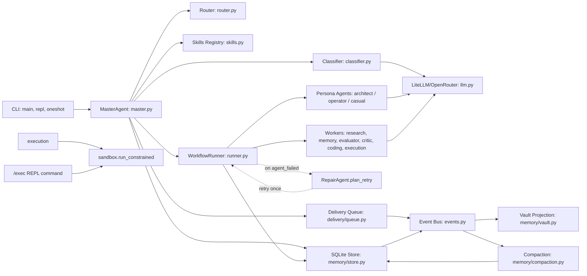
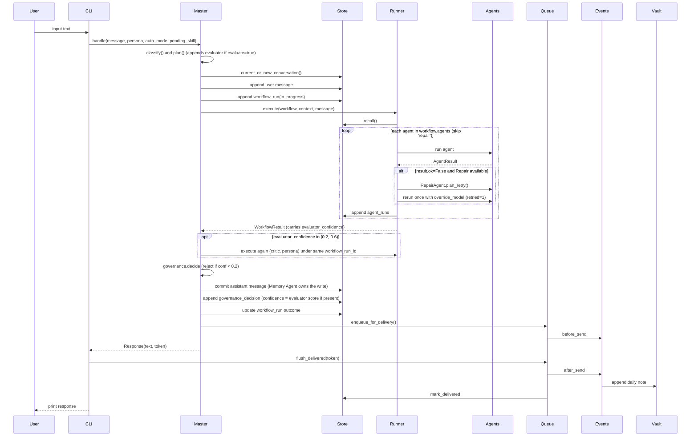
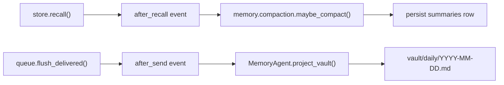
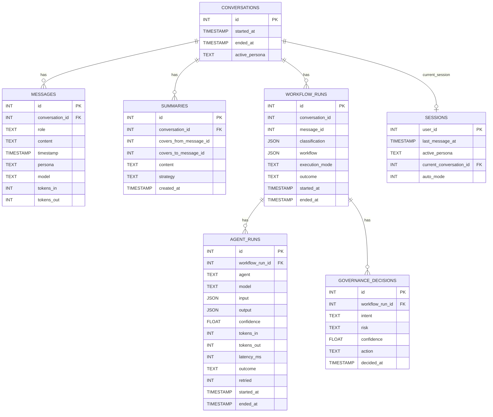
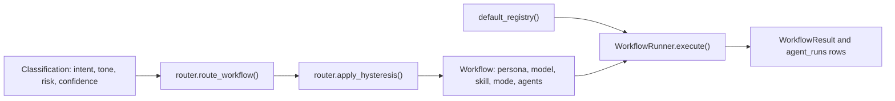
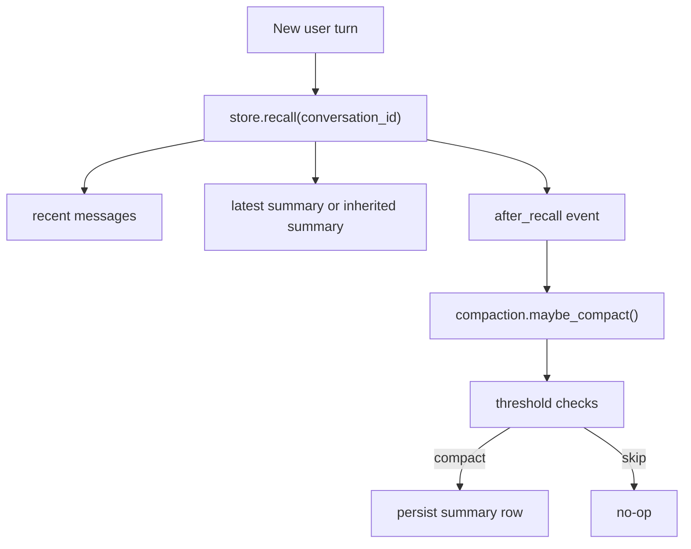
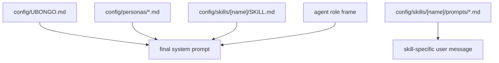

# Ubongo System Architecture (Current Implementation)

This document describes the current codebase state (through Phase 11 in `STATUS.md`), focusing on runtime flow, subsystem boundaries, and persistent data model.

Diagram source file (editable in draw.io):
- [system-architecture.drawio](./diagrams/system-architecture.drawio)

## 1) Runtime Components

Draw.io page: `Runtime Components`

Summary:
- CLI (`__main__.py`, `repl.py`, `oneshot.py`) enters through `MasterAgent`.
- `MasterAgent` handles classify/plan/execute/govern/compose and persistence seams.
- `WorkflowRunner` dispatches worker agents from a registry of ten: three personas (`architect`, `operator`, `casual`), `research`, `memory`, `evaluator`, `critic`, `coding`, `execution`, `repair`. Persona names are bare (no `persona:` prefix as of Phase 10).
- The runner consults `RepairAgent.plan_retry` on `agent_failed` and re-dispatches the failing agent ONCE with a model fallback (Phase 11d). The retry's row is marked `agent_runs.retried = 1`.
- `sandbox.py` (Phase 11b) is the single safety contract for shell execution; the Execution Agent and the `/exec` REPL command both route through it.
- Queue and event bus coordinate side effects (`before_send`, `after_send`).
- SQLite store is canonical memory; vault is projected markdown.

## 2) End-to-End Turn Flow

Draw.io page: `Turn Flow`

Flow:
1. User input (REPL or one-shot)
2. `MasterAgent.handle()` classify + plan (plan appends `evaluator` to `workflow.agents` when `workflows.yaml` declares `evaluate: true`)
3. Persist user turn + insert `workflow_runs` (`in_progress`)
4. `WorkflowRunner.execute()` agent dispatch; on `agent_failed` consult `RepairAgent.plan_retry` and rerun once with model fallback
5. Phase 10 borderline confidence (evaluator score in `[0.2, 0.6)`) triggers a second runner pass `(critic, persona)` under the same `workflow_run_id`; the retry's text replaces the response
6. `MasterAgent.decide()` runs governance with `evaluator_confidence`; reject below `0.2` overrides response text with `_REJECT_MESSAGE`
7. Persist assistant turn (Memory Agent owns the write) + governance decision + workflow outcome update
8. Enqueue response + `before_send`
9. Print response to terminal
10. `flush_delivered()` -> `after_send` -> vault projection -> mark delivered

## 3) Events and Side Effects

Draw.io page: `Events and Side Effects`

Key event chains:
- `store.recall()` -> `after_recall` -> `memory.compaction.maybe_compact()`
- `queue.flush_delivered()` -> `after_send` -> `MemoryAgent.project_vault()` -> daily note append

## 4) SQLite Data Model

Draw.io page: `SQLite Data Model`

Core operational tables:
- `conversations`, `messages`, `summaries`, `sessions`
- `workflow_runs`, `agent_runs`, `governance_decisions`
- `notification_queue`

Future-phase tables already present in schema:
- `facts`, `evolution_lineage`, `evolution_evaluations`, `pending_promotions`, `active_evolutions`, `vault_links`

## 5) Workflow + Agent Model

Workflows are configured in `config/workflows.yaml` and routed by `config/routing.yaml`.

Current execution mode implemented: `sequential`. Phase 12 adds parallel / competitive / collaborative / debate / speculative.

Runtime pattern:
- `classifier.classify()` -> `router.route_workflow()` + hysteresis
- Workflow template resolves to ordered agent list; if `evaluate: true`, plan appends `evaluator`
- `WorkflowRunner` executes agents in order, calls `RepairAgent.plan_retry` on failures, threads each agent's text into the next agent's `prior_findings`, and persists `agent_runs`
- `WorkflowResult.text` comes from the LAST agent whose class declares `composer = True` (the personas + Coding Agent today). Validators (Evaluator / Critic) and helpers (Research / Execution) contribute findings without claiming the response.
- `WorkflowResult.evaluator_confidence` is harvested from any agent's `AgentResult.confidence` (the evaluator sets it). Master forwards it to `governance.decide` and to `governance_decisions.confidence`.

## 6) Memory, Recall, and Compaction

Operational behavior:
- Recall returns recent messages + latest summary (or inherited summary from another conversation).
- `after_recall` can trigger compaction when thresholds are exceeded.
- Compaction persists cumulative summaries that preserve long-horizon facts beyond recall window.

## 7) REPL Command Surface

Implemented command families in `repl.py`:
- Persona and mode: `/architect`, `/operator`, `/casual`, `/auto`
- Skills/meta: `/skill <name>`, `/skills`, `/summary`, `/reload`
- Observability: `/queue [N]`, `/decisions [N]`, `/agents`, `/trace [N]` (Phase 10)
- Sandbox debug: `/exec <cmd>` (Phase 11; bypasses `master.handle`, no workflow_runs row)
- Control: `/exit`

## 8) Prompt and Configuration Hierarchy

Prompt assembly layers:
1. `config/UBONGO.md` (global identity)
2. `config/personas/*.md` (persona overlay)
3. `config/skills/<name>/SKILL.md` (active skill body, when used)
4. Agent-role framing (worker-specific instructions)

Skill activation templates are loaded from `config/skills/<name>/prompts/*.md` for skill-specific user messages (for example `/summary`).

The `constrained-bash` skill (Phase 11) is a special case: its SKILL.md body and prompt are LLM-facing metadata only; the actual safety contract is enforced in `src/ubongo/sandbox.py`. Anything that affects what runs on the user's machine must be in code the LLM cannot rewrite.

## 9) Phase 10 + 11 Patterns

Three patterns introduced in Phases 10 and 11 that later phases inherit:

- **Composer attribute (Phase 10).** Agents declare `composer: bool` (read via `getattr(agent, "composer", False)`; default False). The runner picks `WorkflowResult.text` from the LAST composer agent's text, not the last successful agent. This lets validators (Evaluator, Critic) and helpers (Research, Execution) run AFTER the persona without claiming the response. In `coding_session` BOTH `coding` and `architect` are composers; last-composer-wins makes the architect's wrap the user-facing reply.
- **Borderline-Critic loop (Phase 10).** When the Evaluator returns confidence in `[0.2, 0.6)`, Master runs a SECOND `runner.execute(...)` pass with `agents=("critic", persona)` under the same `workflow_run_id`. The retry's text replaces the response. Below `0.2` the governance stub returns `reject` and Master overrides the response text with `_REJECT_MESSAGE` (the rejection is still committed to messages + vault for `/recall` coherence).
- **Repair-by-runner (Phase 11).** `RepairAgent` lives in the registry but never runs as a workflow step. The runner consults `RepairAgent.plan_retry(failed_agent, original_result, input)` on `agent_failed`; if it returns a `{"model": ...}` plan, the runner reruns the failing agent ONCE with `override_model` plumbed through `AgentInput.metadata`. Each agent is retried at most once per workflow run. The retry row is marked `agent_runs.retried = 1` and `/trace` renders `(retried)` on it.

---

When runtime architecture changes, update this document and the draw.io file together.
