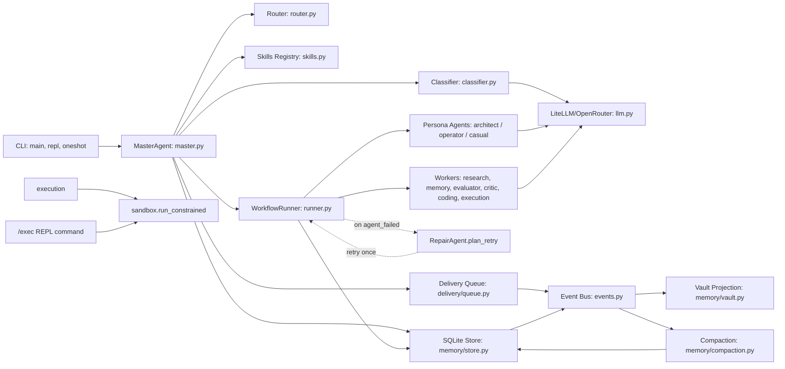
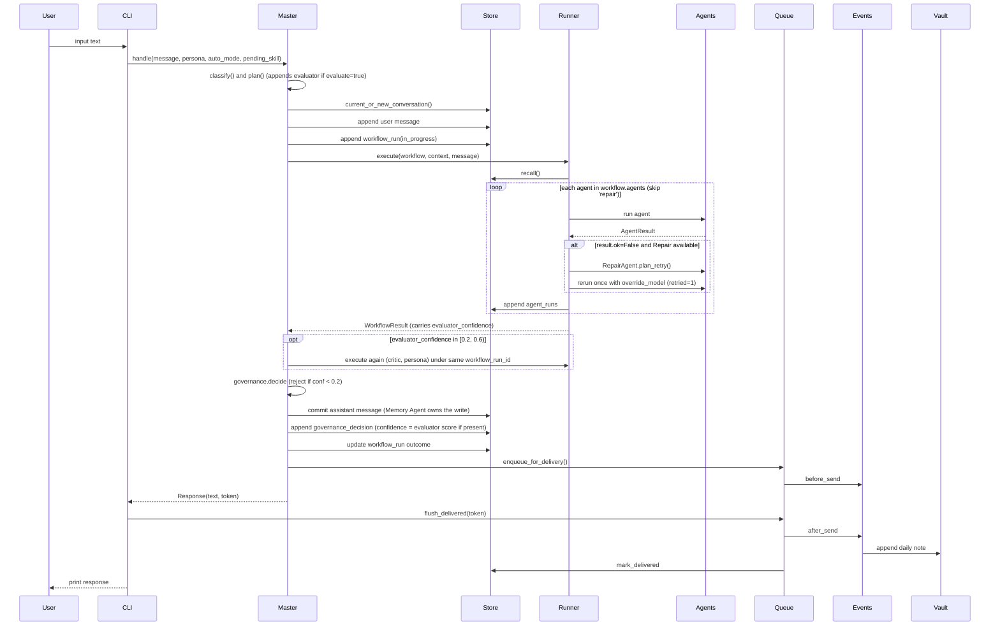
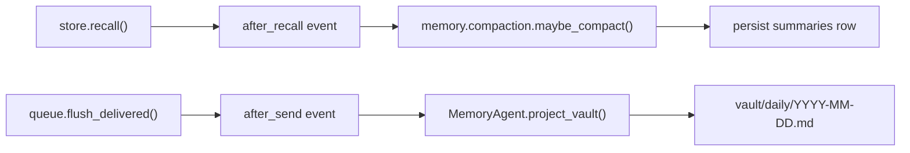
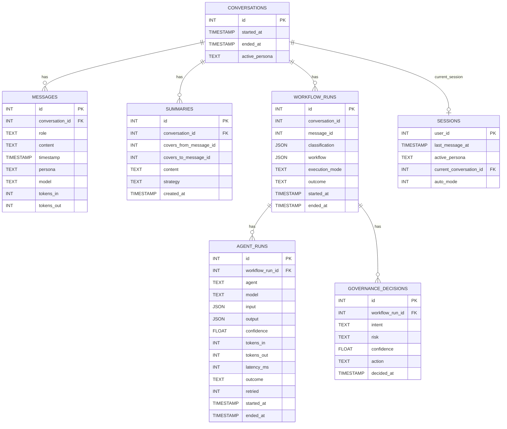
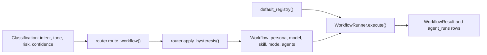
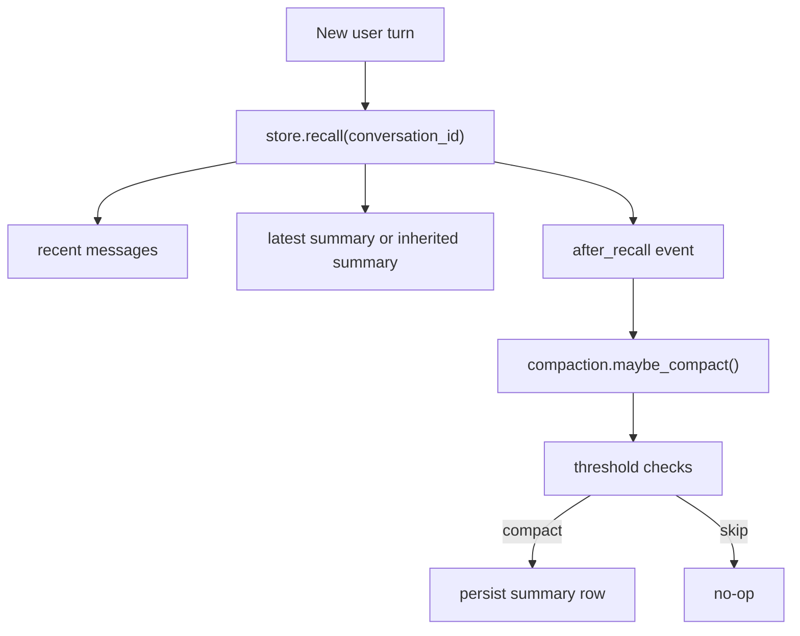
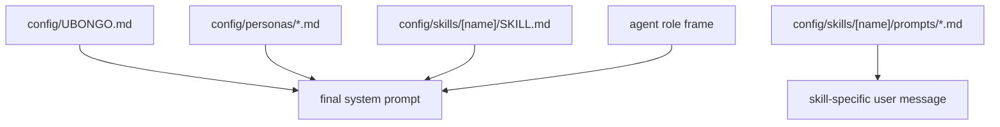

# Ubongo System Architecture (Current Implementation)

This document describes the current codebase state (**v0.1 complete — all 22 phases (0–21) merged**), focusing on runtime flow, subsystem boundaries, and persistent data model. For a layered C4 view see [docs/architecture/](architecture/README.md); this file is the single-page runtime reference. Beyond the synchronous turn loop below, two background daemon threads (the GP self-improvement loop and the vault-sync watcher) are started/stopped by the REPL; see sections 9–10.

Diagram source file (editable in draw.io):
- [system-architecture.drawio](./diagrams/system-architecture.drawio)

## 1) Runtime Components

Draw.io page: `Runtime Components`

Summary:
- CLI (`__main__.py`, `repl.py`, `oneshot.py`) enters through `MasterAgent`.
- `MasterAgent` handles classify/plan/execute/govern/compose and persistence seams.
- `WorkflowRunner` dispatches worker agents from a registry of ten: three personas (`architect`, `operator`, `casual`), `research`, `memory`, `evaluator`, `critic`, `coding`, `execution`, `repair`. Persona names are bare (no `persona:` prefix as of Phase 10).
- The runner walks the full Repair strategy ladder on `agent_failed` (Phase 13): `RepairAgent.plan_recovery` classifies the failure into one of seven `FailureKind`s and returns an ordered `RecoveryPlan` (variant prompt -> different model -> smaller model + shorter prompt -> peer replacement -> abort), capped at `agents.repair.max_attempts`. In `sequential` mode the runner drives the whole ladder; in the five fan-out modes Repair acts only by peer replacement. Each attempt is persisted to `repair_runs`; the recovered retry's `agent_runs` row is marked `retried = 1`. (Phase 11's `plan_retry` shim is retained for back-compat.)
- `sandbox.py` (Phase 11b, hardened Phase 15c) is the single safety contract for shell execution: an allowlist resolved to absolute program paths, no shell metacharacters, no path traversal, a filesystem allowlist (path args must resolve inside the repo), `shell=False`, an empty child `PATH`, repo-root cwd, and a 10s timeout. The Execution Agent and the `/exec` REPL command both route through it. Full contract in [docs/SECURITY.md](SECURITY.md).
- Queue and event bus coordinate side effects (`before_send`, `after_send`).
- SQLite store is canonical memory; vault is projected markdown.

## 2) End-to-End Turn Flow

Draw.io page: `Turn Flow`

Flow:
1. User input (REPL or one-shot)
2. `MasterAgent.handle()` classify + plan (plan appends `evaluator` to `workflow.agents` when `workflows.yaml` declares `evaluate: true`)
3. Persist user turn + insert `workflow_runs` (`in_progress`)
4. `WorkflowRunner.execute()` agent dispatch; on `agent_failed` consult `RepairAgent.plan_retry` and rerun once with model fallback
5. Phase 10 borderline confidence (evaluator score in `[0.2, 0.6)`) triggers a second runner pass `(critic, persona)` under the same `workflow_run_id`; the retry's text replaces the response
6. `MasterAgent.decide()` runs the governance decision matrix (Phase 14, `config/governance.yaml`): `score_risk` / `score_confidence` / `score_reversibility` feed a 5-rule matrix returning `auto` / `ask_clarification` / `require_approval` / `reject`. A `_GATED_MESSAGES` map swaps the response for non-`auto` actions; `require_approval` additionally attaches an `ApprovalRequest` that the REPL surfaces as an interactive `y/n/why` gate (Phase 15) — `y` re-issues the turn with `approved=True`, the choice persists to `governance_decisions.approval_response`. One-shot is non-interactive (gated turns exit `rc=1`).
7. Persist assistant turn (Memory Agent owns the write) + governance decision + workflow outcome update
8. Enqueue response + `before_send`
9. Print response to terminal
10. `flush_delivered()` -> `after_send` -> vault projection -> mark delivered

## 3) Events and Side Effects

Draw.io page: `Events and Side Effects`

Key event chains:
- `store.recall()` -> `after_recall` -> `memory.compaction.maybe_compact()`
- `queue.flush_delivered()` -> `after_send` -> `MemoryAgent.project_vault()` -> daily note append

## 4) SQLite Data Model

Draw.io page: `SQLite Data Model`

Core operational tables:
- `conversations`, `messages`, `summaries`, `sessions`
- `workflow_runs`, `agent_runs`, `governance_decisions` (carries `risk` / `confidence` / `reversibility` / `action` / `approval_response`), `repair_runs` (one row per Repair strategy attempt, Phase 13)
- `notification_queue`, `vault_links`
- Evolution (Tier 5): `evolution_lineage`, `evolution_evaluations`, `evolution_runs`, `evolution_state`, `pending_promotions`, `active_evolutions`
- Wiki memory (Tier 6): `embedding_meta`, `vault_state`, `vault_conflicts`, plus the lazily-created `vec_messages` / `vec_vault` sqlite-vec virtual tables

Schema present, reserved for v0.2+:
- `facts`

## 5) Workflow + Agent Model

Workflows are configured in `config/workflows.yaml` and routed by `config/routing.yaml`.

All six execution modes are live (Phase 12): `sequential`, `parallel`, `competitive`, `collaborative`, `debate`, `speculative`. The `WorkflowRunner` is async internally (one strategy coroutine per mode, selected off `workflow.execution_mode`) but sync at its public `execute()` boundary. Only `sequential` and `parallel` auto-route; the other four are opt-in per turn via `/mode <workflow>`. `competitive` uses `EvaluatorAgent.rank()` to pick a winner; `speculative` uses `EvaluatorAgent.agree()`; `debate` runs N rounds (default 2) then a synthesizer turn.

Runtime pattern:
- `classifier.classify()` -> `router.route_workflow()` + hysteresis
- Workflow template resolves to ordered agent list; if `evaluate: true`, plan appends `evaluator`
- `WorkflowRunner` executes agents in order, calls `RepairAgent.plan_retry` on failures, threads each agent's text into the next agent's `prior_findings`, and persists `agent_runs`
- `WorkflowResult.text` comes from the LAST agent whose class declares `composer = True` (the personas + Coding Agent today). Validators (Evaluator / Critic) and helpers (Research / Execution) contribute findings without claiming the response.
- `WorkflowResult.evaluator_confidence` is harvested from any agent's `AgentResult.confidence` (the evaluator sets it). Master forwards it to `governance.decide` and to `governance_decisions.confidence`.

## 6) Memory, Recall, and Compaction

Operational behavior:
- Recall returns recent messages + latest summary (or inherited summary from another conversation).
- `after_recall` can trigger compaction when thresholds are exceeded.
- Compaction persists cumulative summaries that preserve long-horizon facts beyond recall window.

## 7) REPL Command Surface

Implemented command families in `repl.py`:
- Persona and mode: `/architect`, `/operator`, `/casual`, `/auto`, `/mode <workflow> | list` (Phase 12; pins the next turn's workflow/execution mode)
- Skills/meta: `/skill <name>`, `/skills`, `/summary`, `/reload` (Phase 21: also hot-reloads settings + routing)
- Observability: `/queue [N]`, `/decisions [N]`, `/agents`, `/trace [N]` (Phase 10), `/policy` (Phase 14; prints the live decision matrix)
- Sandbox debug: `/exec <cmd>` (Phase 11; bypasses `master.handle`, no workflow_runs row)
- Self-improvement (Tier 5): `/optimize <target>` (generate variants), `/evaluate <target>` (fitness leaderboard), `/evolution <status|pause|resume|off>` (the background loop), `/improvements [approve|reject <id> | rollback <target>]` (promotions + live swap)
- Wiki memory (Tier 6): `/recall [query]` (recency + semantic + vault-graph neighbors), `/audit [category] [N]` (unified audit tail), `/conflicts [resolve <id> <keep-mine|keep-theirs|merge>]` (vault edit collisions)
- Control: `/exit`

## 8) Prompt and Configuration Hierarchy

Prompt assembly layers:
1. `config/UBONGO.md` (global identity)
2. `config/personas/*.md` (persona overlay)
3. `config/skills/<name>/SKILL.md` (active skill body, when used)
4. Agent-role framing (worker-specific instructions)

Skill activation templates are loaded from `config/skills/<name>/prompts/*.md` for skill-specific user messages (for example `/summary`).

The `constrained-bash` skill (Phase 11) is a special case: its SKILL.md body and prompt are LLM-facing metadata only; the actual safety contract is enforced in `src/ubongo/sandbox.py`. Anything that affects what runs on the user's machine must be in code the LLM cannot rewrite.

## 9) Cross-Cutting Patterns

Patterns introduced across the tiers that later phases inherit:

- **Composer attribute (Phase 10).** Agents declare `composer: bool` (read via `getattr(agent, "composer", False)`; default False). The runner picks `WorkflowResult.text` from the LAST composer agent's text, not the last successful agent. This lets validators (Evaluator, Critic) and helpers (Research, Execution) run AFTER the persona without claiming the response. In `coding_session` BOTH `coding` and `architect` are composers; last-composer-wins makes the architect's wrap the user-facing reply.
- **Borderline-Critic loop (Phase 10).** When the Evaluator returns confidence in `[0.2, 0.6)` (band now in `governance.yaml::thresholds.critic_band`), Master runs a SECOND `runner.execute(...)` pass with `agents=("critic", persona)` under the same `workflow_run_id`. The retry's text replaces the response.
- **Repair ladder (Phase 13; supersedes Phase 11's single retry).** `RepairAgent` lives in the registry but never runs as a workflow step. On `agent_failed` the runner consults `RepairAgent.plan_recovery`, which classifies the failure into one of seven `FailureKind`s and returns an ordered `RecoveryPlan` (variant prompt -> different model -> smaller model + shorter prompt -> peer replacement -> abort), capped at `agents.repair.max_attempts`. `sequential` drives the full ladder; fan-out modes use peer replacement only. Every attempt persists to `repair_runs`; `/trace` renders an indented `repair:` line, and a recovered turn sets `workflow_runs.outcome='repaired'`.
- **Governance decision matrix (Phases 14-15; supersedes the Phase-10 reject stub).** `score_risk` / `score_confidence` / `score_reversibility` feed a 5-rule matrix in `governance.yaml` returning `auto` / `ask_clarification` / `require_approval` / `reject`. Non-`auto` actions swap the response via `_GATED_MESSAGES`; `require_approval` drives the REPL's interactive `y/n/why` gate, with the choice persisted to `governance_decisions.approval_response`. Gated turns are still committed to messages + vault for `/recall` coherence.
- **Commit-on-success buffer (Phase 13).** `master.handle` wraps the turn body in a `workflow_buffer` (`memory/write_buffer.py`): the assistant-message commit is staged and either `commit()`ed on `result.ok` or `drop()`ped on failure, so a half-finished turn never leaves partial rows. Phase 16+ writers inherit the seam.
- **GP self-improvement loop (Tier 5, Phases 16-19).** The `src/ubongo/evolution/` package closes a full loop: `generator` mutates an evolvable **target** (kind `prompt` for `persona:*`, kind `config` for `routing:default` / `toolchain:<wf>` / `retry:repair`) into a generation of variants in `evolution_lineage`; `sandbox` evaluates each to a cohort-normalized `fitness` (prompt/routing/tool-chain variants are judged by running them; retry uses a structural proxy); `selection` keeps top-K survivors that seed the next generation (cross-generation `parent_id`); the `EvolutionLoop` daemon runs cycles continuously but throttled, paced, and **paused by default**; `promotion` proposes a winner to `pending_promotions` only when it beats the active baseline, and the user approves via `/improvements`. Approval writes `active_evolutions` and performs a **live swap**: the runtime read paths (`context.build_system_prompt` for personas, `router.route_workflow` / `router.workflow_agents` for config) consult `active_evolutions`, guarded by `store.is_connected`.
- **Semantic recall (Tier 6, Phase 20).** `store.recall(conversation_id, query)` embeds the query and KNN-searches `vec_messages` (`sqlite-vec`) for relevant turns outside the recency window, folded into the turn as a labelled context block. Messages are indexed idempotently on write (`embedding_meta` hash). Everything is best-effort behind a `vec_available()` guard — disabled/unavailable degrades to recency-only with no error, and an embedding never blocks a message commit.
- **Bidirectional vault sync (Tier 6, Phase 21).** The `VaultWatcher` daemon (no dependency, mirroring `EvolutionLoop`) polls the vault and ingests external edits (re-embed into `vec_vault`), distinguishing its own writes from user edits via the `vault_state` hash. Collisions queue to `vault_conflicts` (`/conflicts`). Governance, evolution, and sync decisions unify into `vault/system/audit.md` (`/audit`); `/reload` hot-reloads settings (`config.reload()` before `personas.reload()`).

---

When runtime architecture changes, update this document and the draw.io file together.
